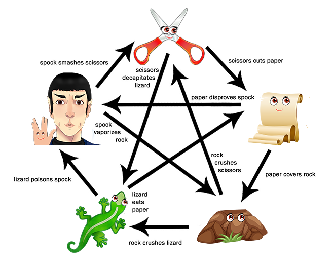

# Game:  Rock, Scissors, Paper, Lizard, Spock

### [Live site](https://olgakuvs.github.io/game-rspls/index.html)

## Contents:

- <a href="#introduction">Introduction</a>
- <a href="#design">Design of the website</a>    
    - <a href="#fonts">Fonts and colours</a>
- <a href="#flow">Game Flow</a>
- <a href="#technologies">Technologies Used</a>
    - <a href="#languages">Languages</a>
    - <a href="#frameworks">Frameworks, Libraries & Programs Used</a>
- <a href="#testing">Testing</a>
    - <a href="#validation">Validation</a>
    - <a href="#browser">Browser compatability</a>
    - <a href="#responsiveness">Responsiveness</a>
    - <a href="#manual_testing">Manual Testing</a>
    - <a href="#functional_testing">Functional Testing</a>
    - <a href="#bugs">Bugs</a>
- <a href="#deployment">Deployment</a>
- <a href="#credits">Credits</a>
- <a href="#acknowledgements">Acknowledgements</a>       
    

## 
Introduction

This is a web-based implementation of the game "Rock, Scissors, Paper, Lizard, Spock". The game is an extension of the classic game "Rock, Paper, Scissors" with two additional options added. The game is played between two players, in this case, a user and a computer. Each player simultaneously chooses one of the five options: rock, paper, scissors, lizard, or Spock. The winner is determined by the following rules:

- Rock crushes Scissors
- Rock crushes Lizard
- Scissors cut Paper
- Scissors decapitate Lizard
- Paper covers Rock
- Paper disproves Spock
- Lizard eats Paper
- Lizard poisons Spock
- Spock smashes Scissors
- Spock vaporizes Rock

If both players choose the same option, it's a tie.

To play the game, simply open the index.html file in your web browser. You will be prompted to choose your move by clicking on the appropriate button. The computer's move will be randomly generated, and the winner or tie will be displayed on the screen.

There are three levels; a new icon is added at the new level:
- The first level includes Rock, Scissors and Paper. 
- The second level features the Lizard icon. 
- The third level features a Spock icon.

## 
Design of the website

### 
Fonts and colours

**Nanum Gothic** was used for the body and **Alkatra** for the headings and the logo. Sans Serif was chosen as the backup font. These fonts for the text and contrast colours for game icons have been chosen because they are eye-catching, make a suitable atmosphere, and help convey a sense of energy. Simple game icons help keep the site clear and easy to use.

To create the colour pallete I used [Adobe Color](https://color.adobe.com/create/color-wheel).

The mockup for the website was created on [Adobe Illustrator](https://www.adobe.com/products/illustrator.html). To make the game icons more lively and fun, I drew their eyes. 

### 
Game Flow

I used [Flowchart Maker and Online Diagram Software](https://app.diagrams.net/) to create a flowchart an easy-to-follow process. It was nessesary for me to understand the logic needed to complete the project and in what order I should approach it from.

When the user loads up the game they are presented with the game rules and start button:

At level 1, the user can choose one of three icons: Rock, Scissors or Paper

When the user clicks on the game icon, a pop-up window appears with his choice, the choice of computer and the inscription who won: 

The game goes up to 3 wins.
If the computer wins 3 times, then a popup window appears with 2 options: start the game from the beginning or go to the main page:

If the user wins 3 times, then a popup window appears with 3 options: start the game from the beginning, go to level up or to the main page:

At level 2 there are 4 game icons: Rock, Scissors, Paper and Lizard.

At level 3 user can choose from 5 game icons: Rock, Scissors, Paper, Lizard or Spock.

If the user won at level 3, a popup window appears with congratulations and 2 buttons to choose from: restart game and main menu.

The game logo at the header links to the main page from every page on the site as this is expected by the user.

## 
Technologies Used

### 
Languages

- **HTML5** used to structure my website.
- **CSS3** used to style and add circular dropdown game icons to my project.
- **JavaScript** used to make the site dynamic, compare user and computer choices, analyze and display the result.

### 
Frameworks, Libraries & Programs Used

- [Flowchart Maker and Online Diagram Software](https://app.diagrams.net/) used to create a flowchart for the game.
- [Google Fonts](https://fonts.google.com/) used to import Alkatra and Nanum Gothic fonts into the style.css file which are used on all pages of the project.
- [Adobe Illustrator](https://www.adobe.com/products/illustrator.html) used to create game icons and game rules image.
- [Am I Responsive](https://ui.dev/amiresponsive) used to generate screenshot of different screens.
- [W3Schools](https://www.w3schools.com/) used for general search for JavaScript, HTML and CSS syntax queries.
- [CSS-Tricks](https://css-tricks.com/) used for help with flex box and alignment.
- [Git](https://git-scm.com/) used for version control by utilizing the Gitpod terminal to commit to Git and Push to GitHub.
- [GitHub](https://github.com/) used to store the project's code after being pushed from Git.
- [Gitpod](https://www.gitpod.io/)

## 
Testing

### 
Validation

 - Use [W3C Markup Validation Service](https://validator.w3.org/) to validate index.html page. The page pass with no errors and no warnings to show.

 

 - Use [W3C CSS Validation Service](https://jigsaw.w3.org/css-validator/) to validate CSS file. File pass with no errors.

 

 - Lighthouse in Chrome DevTools used to check performance. No significant errors were found.

 

 ### 
Browser compatibility

The website was tested on the following browsers:

- Google Chrome
- Mozilla Firefox
- Microsoft Edge

### 
Responsiveness

The website was tested on numerous sized screens including iPhones SE, XR, 12 Pro, Samsungs Galaxy S8, S20, Redmi Note 9, iPad Air, Mini, 15" laptop and was found to respond as expected to all sizes. Chrome DevTools was used throughout the design process to check responsiveness and breakpoints. Adjustments were made accordingly.

### 
Manual Testing

|  Test |  Result |   
|---|---|
| When the user clicks on the start game button game runs. | Pass |
| When the user chooses an icon the result window popups. | Pass |
| Depending on the choice of computer, the comparison with the choice of the user and the result shown are correct. | Pass |
| After each move, the score is displayed correctly. | Pass |
| When moving to the next level, the score is reset to zero. | Pass |
| The counter correctly adds the score after each move. | Pass |
| When the user won 3 times, a window appears with the ability to move to the next level. | Pass |
| When the computer won 3 times, a window appears with the ability to restart game. | Pass |
| When moving to the next level, 1 more game icon is added.  | Pass |
| If the user won 3 times on the 3rd level, then a popup window appears with congratulations.  | Pass |
| The game logo at the header links to the main page from every page. | Pass |

### 
Functional Testing

|  Test |  Result |   
|---|---|
| The user played "Rock" and the computer played "Scissors" | User wins |
| The user played "Rock" and the computer played "Lizard"  | User wins  |
| The user played "Rock" and the computer played "Scissors" | User loses |
| The user played "Rock" and the computer played "Spock"  | User loses |
| The user played "Paper" and the computer played "Rock"   |  User wins  |
| The user played "Paper" and the computer played "Spock"  |  User wins  |
| The user played "Paper" and the computer played "Scissors"  | User loses |
| The user played "Paper" and the computer played "Lizard" | User loses |
| The user played "Scissors" and the computer played "Paper" | User wins |
| The user played "Scissors" and the computer played "Lizard"  | User wins |
| The user played "Scissors" and the computer played "Rock"  | User loses |
| The user played "Scissors" and the computer played "Spock" | User loses |
| The user played "Lizard" and the computer played "Paper" | User wins |
| The user played "Lizard" and the computer played "Spock"  | User wins |
| The user played "Lizard" and the computer played "Rock"  | User loses |
| The user played "Lizard" and the computer played "Scissors"  | User loses |
| The user played "Spock" and the computer played "Rock" | User wins |
| The user played "Spock" and the computer played "Scissors"  | User wins |
| The user played "Spock" and the computer played "Paper"  | User loses |
| The user played "Spock" and the computer played "Lizard"  | User loses |
| The user and the computer played the same  | Tie |

### 
Bugs

|  Issue |  Solution |   
|---|---|
| When moving to the next level second instance of game icons was added by addEventListerner and the counter showed incorrect numbers. | addEventListener method was moved to the beginning of the file. |
| The computer always chose only from 3 icons. | Added the function to check the level of the game and set the required number of icons to select.  |
| When restarting the game, the values ​​of the variables were not reset. | Added a flag that kept track of whether the game was started for the first time or restarted. |
| When a popup window appeared, not all game icons disappeared. | Added functions to hide and show different sections on the page. |
| After the end of the game, the score was not reset. | Fixed bugs in setGameLevel function to finish the game properly. |

## 
Deployment

The site was deployed to GitHub pages. The steps to deploy are as follows:

1. Log in to [GitHub](https://github.com/) 
2. Navigate to [OlgaKuvs/game-rspls](https://github.com/OlgaKuvs/game-rspls) in the list of repositories.
3. In the GitHub repository, go to the [Settings](https://github.com/OlgaKuvs/game-rspls/settings).
4. From the left side menu navigate to Pages, then select the Main Branch.
5. Once the main branch has been selected, the page will be automatically refreshed with a detailed ribbon display to indicate the successful deployment.

The live link can be found here: [Game: Rock, Scissors, Paper, Lizard, Spock](https://olgakuvs.github.io/game-rspls/index.html)

## 
Credits

[codeBurger](https://www.youtube.com/watch?v=RR1Ag4SQ54E&ab_channel=codeBurger) - Youtube

- An interesting tutorial on creating a round dropdown menu. An interesting concept of creating a circular menu with a flexible number of items using JavaScript.

All pictures for the website was created by author on [Adobe Illustrator](https://www.adobe.com/products/illustrator.html) based on the templates:

- freepng.ru used to find template pictures for drawing game icons, for example, [Paper](https://www.freepng.ru/png-y00qsf/), [Lizard](https://www.freepng.ru/png-lpwnhj/), etc.

- [Deviantart](https://www.deviantart.com/iamthemiggy/art/RockPaperScissorsLizardSpock-110094764)  used for game rules template picture.

- [ICONPACKS](https://www.iconpacks.net/free-icon/number-two-13218.html) used as templates for game rules numbers.

## 
Acknowledgements

- My mentor Rahul Lakhanpal for his ongoing support and feedback.

