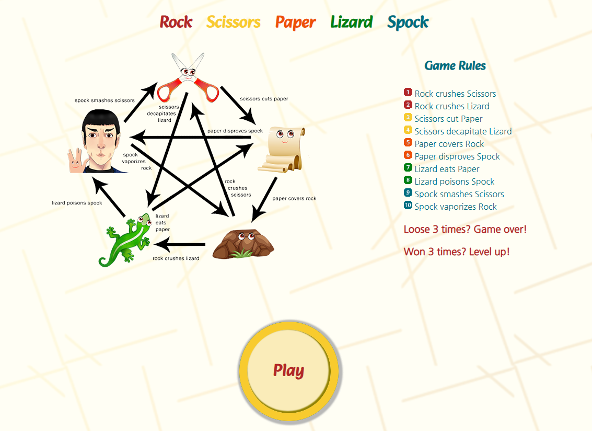

# Game:  Rock, Scissors, Paper, Lizard, Spock

### [Live site](https://olgakuvs.github.io/game-rspls/index.html)

## Contents:

- <a href="#introduction">Introduction</a>
- <a href="#design">Design of the website</a>    
    - <a href="#fonts&colours">Fonts and colours</a>
- <a href="#flow">Game Flow</a>    
    

## 
Introduction

This is a web-based implementation of the game "Rock, Scissors, Paper, Lizard, Spock". The game is an extension of the classic game "Rock, Paper, Scissors" with two additional options added. The game is played between two players, in this case, a user and a computer. Each player simultaneously chooses one of the five options: rock, paper, scissors, lizard, or Spock. The winner is determined by the following rules:

- Rock crushes Scissors
- Rock crushes Lizard
- Scissors cut Paper
- Scissors decapitate Lizard
- Paper covers Rock
- Paper disproves Spock
- Lizard eats Paper
- Lizard poisons Spock
- Spock smashes Scissors
- Spock vaporizes Rock

If both players choose the same option, it's a tie.

To play the game, simply open the index.html file in your web browser. You will be prompted to choose your move by clicking on the appropriate button. The computer's move will be randomly generated, and the winner or tie will be displayed on the screen.

There are three levels; a new icon is added at the new level:
- The first level includes Rock, Scissors and Paper. 
- The second level features the Lizard icon. 
- The third level features a Spock icon.

## 
Design of the website

### 
Fonts and colours

Nanum Gothic was used for the body and Alkatra for the headings and the logo. Sans Serif was chosen as the backup font. Contrast colours for game icons have been chosen because they are eye-catching, make a suitable atmosphere, and help convey a sense of energy. Simple game icons help keep the site clear and easy to use.

To create the colour pallete I used [Adobe Color](https://color.adobe.com/create/color-wheel).

The mockup for the website was created on [Adobe Illustrator](https://www.adobe.com/products/illustrator.html). To make the game icons more lively and fun, I drew their eyes. 

### 
Game Flow

I used [diagrams.net](https://app.diagrams.net/) to create a flowchart an easy-to-follow process. It was nessesary for me to understand the logic needed to complete the project and in what order I should approach it from.

When the user loads up the game they are presented with the game rules and start button:

At level 1, the user can choose one of three icons: Rock, Scissors or Paper

When the user clicks on the game icon, a pop-up window appears with his choice, the choice of computer and the inscription who won: 

The game goes up to 3 wins.
If the computer won 3 times, then a popup window appears with 2 options: start the game from the beginning or go to the main page:

If the user won 3 times, then a popup window appears with 3 options: start the game from the beginning, go to level up or to the main page:

At level 2 there are 4 game icons: Rock, Scissors, Paper and Lizard.

At level 3 user can choose from 5 game icons: Rock, Scissors, Paper, Lizard or Spock.

If the user won at level 3, a popup window appears with congratulations and 2 buttons to choose from: restart game and main menu.

The game logo at the header links to the main page from every page on the site as this is expected by the user.

## 
Technologies Used

### 
Languages

- HTML5 used to structure my website.
- CSS3 used to style and add circular dropdown game icons to my project.
- JavaScript used to make the site dynamic, compare user and computer choices, analyze and display the result.

### 
Frameworks, Libraries & Programs Used

- [Diagrams.net](https://app.diagrams.net/) used to create a flowchart for the game.
- [Google Fonts](https://fonts.google.com/) used to import Alkatra and Nanum Gothic fonts into the style.css file which are used on all pages of the project.
- [Adobe Illustrator](https://www.adobe.com/products/illustrator.html) used to create game icons and game rules image.
- [Am I Responsive](https://ui.dev/amiresponsive) used to generate screenshot of different screens.
- [W3Schools](https://www.w3schools.com/) used for general search for JavaScript, HTML and CSS syntax queries.
- [CSS-Tricks](https://css-tricks.com/) used for help with flex box and alignment.
- [Git](https://git-scm.com/) used for version control by utilizing the Gitpod terminal to commit to Git and Push to GitHub.
- [GitHub](https://github.com/) used to store the project's code after being pushed from Git.
- [Gitpod](https://www.gitpod.io/)